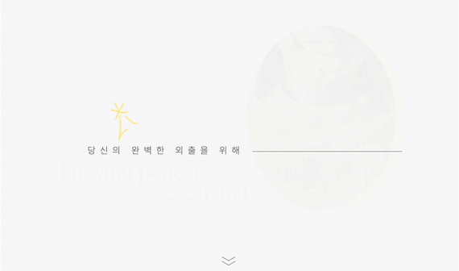

# 🌤 날씨 패션 커뮤니티, 온도衣



## ☂️ 프로젝트 소개

한 번쯤 일기 예보를 보고 옷을 입었다가 다시 집에 돌아온 적도, 손에 짐이 늘어난 적도 있을 것입니다.

또, 어떤 옷을 입을지 고민하느라 꽤 많은 시간을 옷장 앞에서 보내기도 했을 것입니다.

기상청이나 어플에서 전해주는 숫자 데이터만으로는 날씨에 맞는 옷을 입기 어려워졌습니다.

온도衣는 그런 당신의 고민을 덜어주기 위해 태어났습니다.

---

## 📑 목차

- [🌤 날씨 패션 커뮤니티, 온도衣](#-날씨-패션-커뮤니티-온도衣)
  - [☂️ 프로젝트 소개](#️-프로젝트-소개)
  - [📑 목차](#-목차)
  - [🚀 프로젝트 실행 및 테스트](#-프로젝트-실행-및-테스트)
  - [🌩 프로젝트 상세 및 기술 발표](#-프로젝트-상세-및-기술-발표)
  - [🕹 서버,DB 설계](#-서버db-설계)
  - [💻 기술 스택](#-기술-스택)
  - [💾 ERD 설계](#-erd-설계)
  - [🌈 Data-Flow](#-data-flow)
  - [🛠 Data Pipeline](#-data-pipeline)
  - [📜 기능 명세서](#-기능-명세서)
  - [🗂 폴더 구조](#-폴더-구조)
  - [🔒 ENV](#-env)
  - [🧑‍💻 팀원](#-팀원)
    - [고재형](#고재형)
    - [김태영](#김태영)

---

## 🚀 프로젝트 실행 및 테스트

- local에서 테스트 💡

- 실행 명령어

```
git clone https://github.com/leokim1178/camp-tempClothes
cd backend
# .env 추가
docker compose build
docker compose up
```

- graphql에서 테스트하기
  - http://localhost:3000/graphql

---

## 🌩 프로젝트 상세 및 기술 발표

- 프로젝트 상세 :
  - https://leo3179.notion.site/7a84562be1bf4809a1d5b825ca1d8ab8
- 기술 발표 :
  - https://www.youtube.com/watch?v=K2kqhS9XQbc

---

## 🕹 서버,DB 설계

- [API 목록](./readme-imgs/api최종.png)
- Nest.js
- Code-first build
- graphql build : module - resolver - service (social-login, health-checking => controller)
- TypeORM

---

## 💻 기술 스택

<div align="center">
📑&nbsp&nbsp&nbsp구성 언어
<br>
   
   
  </div>

<div align="center">
  🚂  &nbsp&nbsp 서버
  <br>
  
   
  
  </div>

   <div align="center">
🚀&nbsp&nbsp&nbsp 배포
<br>
  
    
  </div>

 <div align="center">
💾&nbsp&nbsp&nbsp 데이터
<br>
  
   
  </div>

 <div align="center">
🔍&nbsp&nbsp&nbsp 채팅
<br>
  
<br>
</div>

---

## [💾 ERD 설계](readme-imgs/%EC%98%A8%EB%8F%84%EC%9D%98%20ERD.png)

---

## [🌈 Data-Flow](./readme-imgs/%EC%98%A8%EB%8F%84%EC%9D%98%20dataflow.001.png)

---

## [🛠 Data Pipeline](./readme-imgs/dataflow.001.png)

---

## 📜 기능 명세서

[온도衣 기능명세서](https://docs.google.com/spreadsheets/d/1e6NoL06xnfxkcbL8yyFnORKwNP7KJ3nIz8Rm7LORrG4/edit#gid=0)

---

## 🗂 폴더 구조

```
🏠 tempClothes project
├─ README.md
├─ backend
│  ├─ README.md
│  ├─ 🌩 cloudBuilds
│  │  ├─ cloudbuild.dev.yaml
│  │  └─ cloudbuild.prod.yaml
│  ├─ 🐳 Dockerfile
│  ├─ 🐳 docker-compose.dev.yaml
│  ├─ 🐳 docker-compose.prod.yaml
│  ├─ 🐳 docker-compose.yaml
│  ├─ 🎒 package.json
│  └─ src
│     ├─ 🍇 apis
│     │  ├─ app : health checker
│     │  ├─ auth : 로그인,로그아웃,소셜로그인 api
│     │  ├─ chat : 채팅 api
│     │  ├─ comment : 댓글, 대댓글 api
│     │  ├─ cron : 크론 탭
│     │  ├─ feed : 피드 api
│     │  ├─ feedImg : 피드 이미지 api
│     │  ├─ feedLike : 피드 좋아요 api
│     │  ├─ feedTag : 피드 태그 api
│     │  ├─ file : 파일 업로드 api
│     │  ├─ iamport : iamport service
│     │  ├─ payment : 결제 api
│     │  ├─ region : 지역 & 날씨 api
│     │  └─ user : 유저 api
│     ├─ 👑 app.module.ts
│     ├─ commons
│     │  ├─ auth : auth strategies & guards
│     │  └─ filter : exception filter
│     └─ main.ts
├─ gitGuideLine.md
└─ static : test htmls
```

<hr>
</hr>

## 🔒 ENV

```
ACCESS_TOKEN_KEY=
REFRESH_TOKEN_KEY=

IMP_KEY=
IMP_SECRET=

STORAGE_BUCKET=
STORAGE_KEY_FILENAME
STORAGE_PROJECT_ID=

GOOGLE_CLIENT_ID=
GOOGLE_CLIENT_SECRET=
KAKAO_CLIENT_ID=
KAKAO_CLIENT_SECRET=
NAVER_CLIENT_ID=
NAVER_CLIENT_SECRET=

OPEN_WEATHER_APP_ID=

SMS_APP_KEY=
SMS_X_SECRET_KEY=
SMS_SENDER=

EMAIL_APP_KEY=
EMAIL_X_SECRET_KEY=
EMAIL_SENDER=

DATABASE_HOST=
DATABASE_NAME=
REDIS_URL=
```

---

## 🧑‍💻 팀원

### 고재형

- Role : `Team Member`
- Position : `Backend`, `Presenter`
- Stack : `JavaScript` `TypeScript` `Nodejs` `Nestjs` `TypeORM` `Axios` `Docker` `Redis` `gitHub` `MySQL`
- Works : User CRUD, 결제기능, 로그인/로그아웃, 실시간채팅, 댓글/대댓글 구현, ERD설계
- Contact :
  - email: jaehyeong1586@gmail.com
  - github: [https://github.com/KoJaeHyeong](https://github.com/KoJaeHyeong)
  - blog: [https://velog.io/@ko1586](https://velog.io/@ko1586)

<hr>
</hr>

### 김태영

- Role : `Team Member`
- Position : `Backend`, `Git`
- Stack : `JavaScript` , `TypeScript`, `TypeORM`, `Nodejs`, `Nestjs`, `MySQL`, `Axios`, `expressjs`, `Docker`, `Redis`, `Kubernetes`, `GCP`, `Github`
- Works : Feed CRUD, Feed 좋아요 CRU, Feed 태그 CRU, Feed 이미지 CRUD, File Upload, CronTab, Region&Weather apis, K8s 서버 배포, 자료 제작

- Contact :

  - email: leo3179@naver.com
  - github: [https://github.com/leokim1178](https://github.com/leokim1178)
  - blog: https://story0tae.tistory.com/

- Tech-Presentation : https://www.youtube.com/watch?v=K2kqhS9XQbc

---

<!-- Markdown link & img dfn's -->
